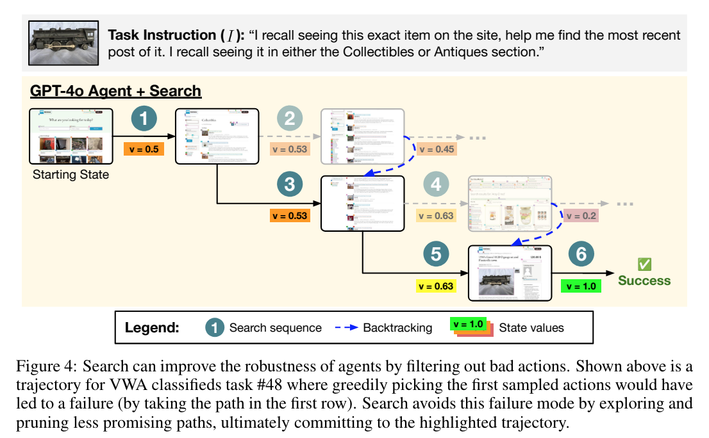

**(논문 요약) TREE SEARCH FOR LANGUAGE MODEL AGENTS** [(Paper)](https://jykoh.com/search-agents/paper.pdf)

## 핵심 내용
- 각 action 을 이행한 history 에 value 를 부여
- llm 에 query 로 value 구함

## 실험 결과

- 잘못된 action 에 빠지지 않음    

