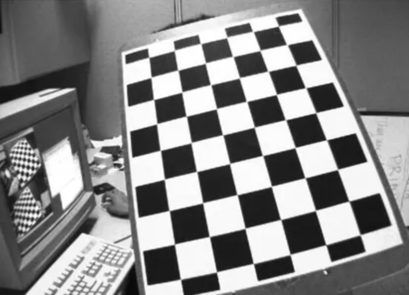
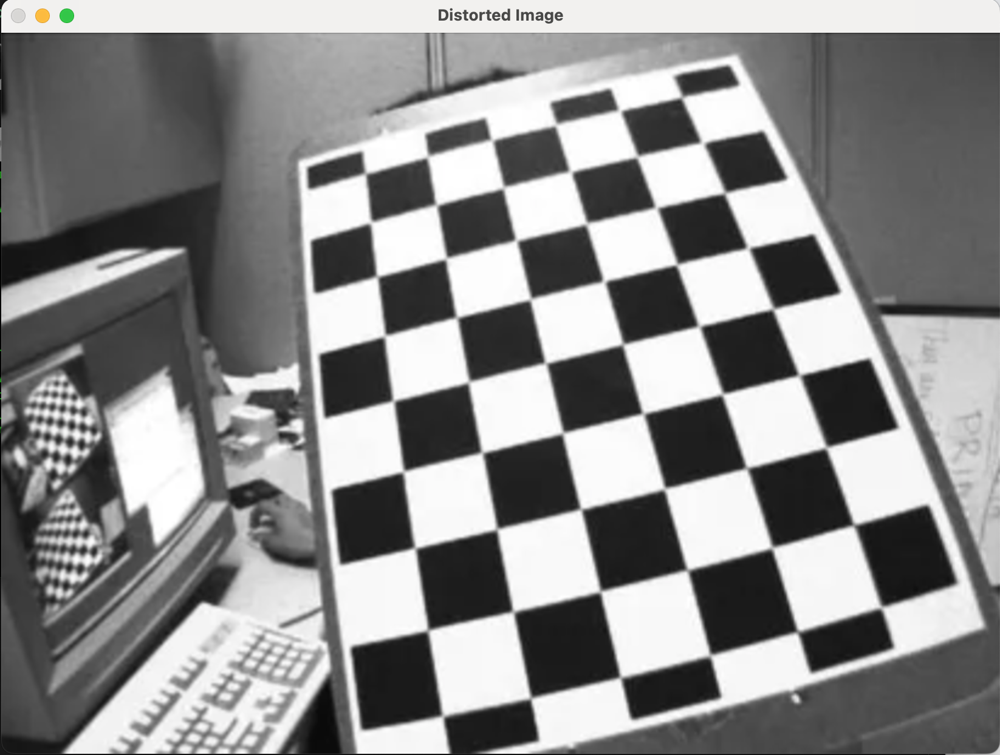
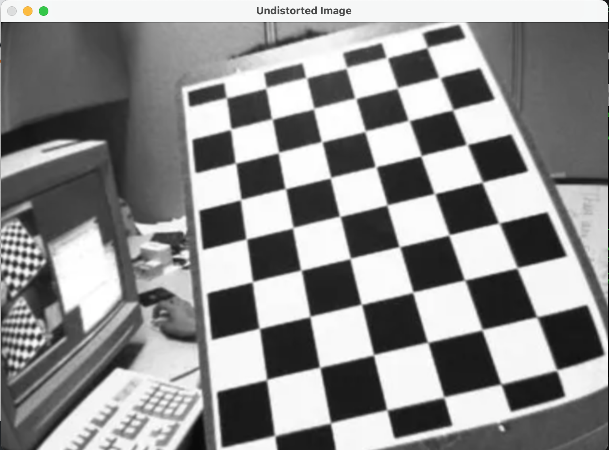
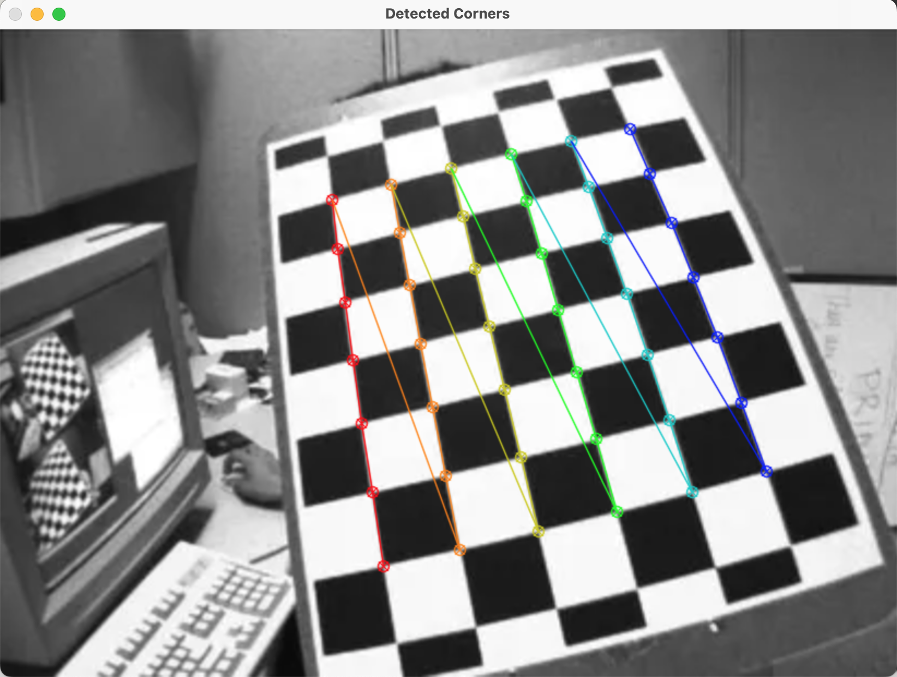

**Undistort Image with OpenCV-Python**

[Reference](https://docs.opencv.org/4.x/dc/dbb/tutorial_py_calibration.html)

[Python File](./data/undistort/undistort_opencv.py)

## Input


## Source Code

```python
import numpy as np
import cv2

# read 7x6 checkboard image
chess_img = cv2.imread("check.png")
chess_gray = cv2.cvtColor(chess_img, cv2.COLOR_BGR2GRAY)
h, w = chess_img.shape[:2]
img_size = (w, h)

corners_detected, corners = cv2.findChessboardCorners(chess_gray, (7,6), None) # checkerboard of (height: 7, width: 6)

if corners_detected:
    
    # set indices for objects (42,3)
    coords_2d = np.mgrid[0:7,0:6] # (2,7,6)
    coords_2d = coords_2d.T # (6,7,2)
    coords_2d = coords_2d.reshape(-1,2) # (42,2)
    obj_points = np.zeros((6*7,3), np.float32) # (42,3)
    obj_points[:,:2] = coords_2d

    # get coordinates of real points on image (42,1,2)
    terminate_criteria = (cv2.TERM_CRITERIA_EPS + cv2.TERM_CRITERIA_MAX_ITER, 30, 0.001)
    img_points = cv2.cornerSubPix(chess_gray, corners, (11,11), (-1,-1), terminate_criteria) # refine corner points (arguments: 11x11 window size, no zero-zone (-1,-1))

    _, camera_matrix, distortion_coeff, rotation, translation = cv2.calibrateCamera([obj_points], [img_points], img_size, None, None)
    
    # get undistorted image
    distorted_camera_matrix, roi = cv2.getOptimalNewCameraMatrix(camera_matrix, distortion_coeff, img_size, 1, img_size)
    dst = cv2.undistort(chess_img, camera_matrix, distortion_coeff, None, distorted_camera_matrix)
    x, y, w, h = roi
    dst = dst[y:y+h, x:x+w]

    # draw chessboard on the original chess image
    chess_img_copy = chess_img.copy()
    cv2.drawChessboardCorners(chess_img_copy, (7,6), img_points, corners_detected)

    # show images
    cv2.imshow('Detected Corners', chess_img_copy)
    cv2.imshow('Undistorted Image', dst)
    cv2.imshow('Distorted Image', chess_img)
    cv2.waitKey(0)
    cv2.destroyAllWindows()
```

## Results




