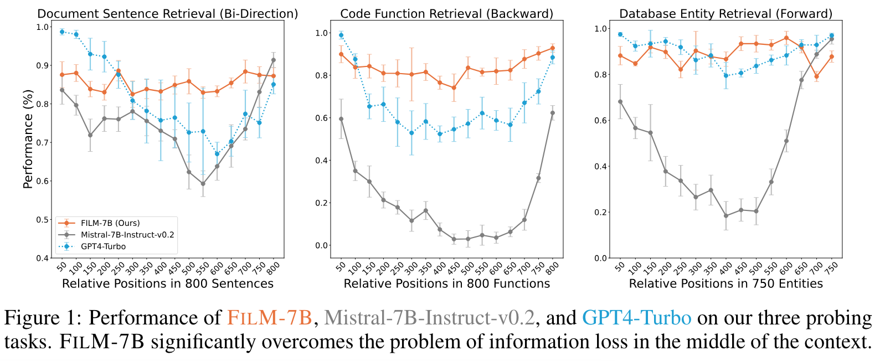
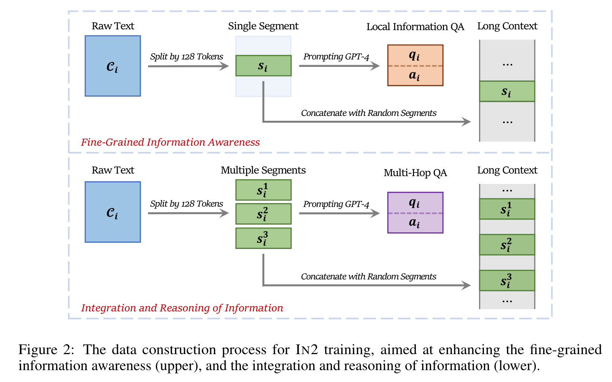
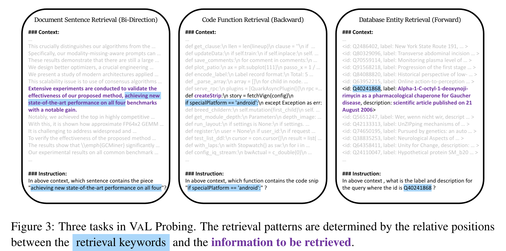
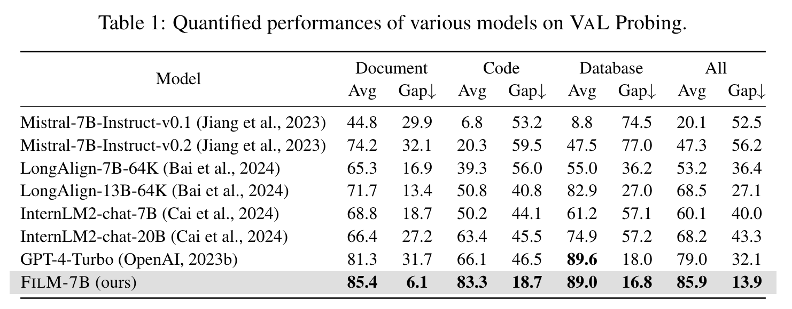
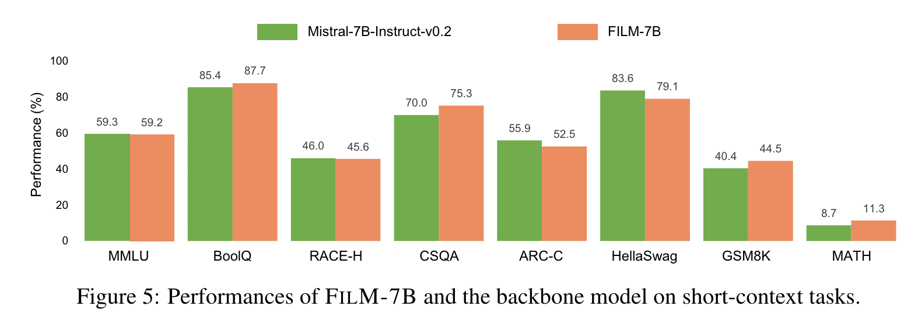
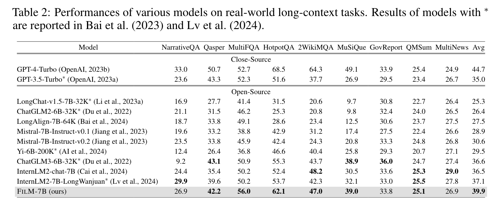

**(논문 요약) Make Your LLM Fully Utilize the Context** [(Paper)](https://arxiv.org/pdf/2404.16811)

## 핵심 내용
- Problems: lost in the middle (가운데 있는 문장에서 정보를 얻어내야할때 잘 못함)  

- Method: INformation-INtensive (IN2) training
  - fine-grained information awareness on a short segment (∼128 tokens) within a synthesized long context (4K−32K tokens)
  - the integration and reasoning of information from two or more short segments
  - Mistral-7B 에 적용하여 성능 개선

- Data: chunking 후, GPT4 로 question, answer set 생성. chunk 는 long context 에 숨김.  

## 실험
- 저자가 만든 task
  
- 저자 task 에서는 성능이 가장 좋음.

- short-context 에서 성능이 떨어지는 경향성은 없어보임.

- benchmark 에서는 gpt-4 가 더 나음.

