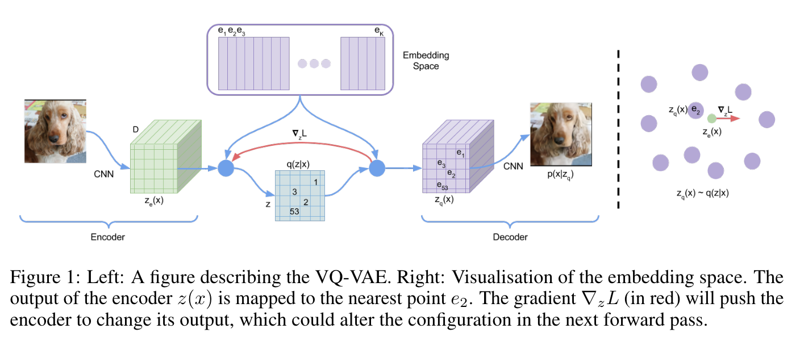
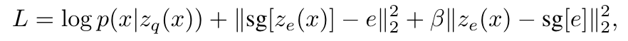

**(논문 요약) Neural Discrete Representation Learning** [(Paper)](https://arxiv.org/pdf/1711.00937)

## 핵심 내용
- Input 을 한정된 codebook 으로 encode
  - $z_e(x)$: encoder 이후 압축된 feature
  - $z_q(x)$: quantized vector (codebook 에서 L2 가 가장 작은 vector)
  - 학습시 decoder 의 $z_q(x)$ gradient 를 $z_e(x)$ 로 그대로 전달하여 encoder 학습    

- Loss 함수  

  - encoder: 1번째, 3번째 항으로 학습
  - decoder: 1번째 항으로 학습
  - embeddings: 2번째 항으로 학습
  - sg: stop-gradient  

