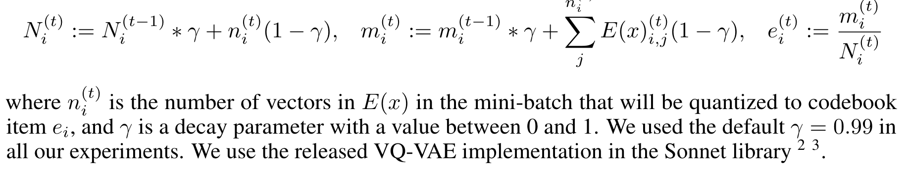
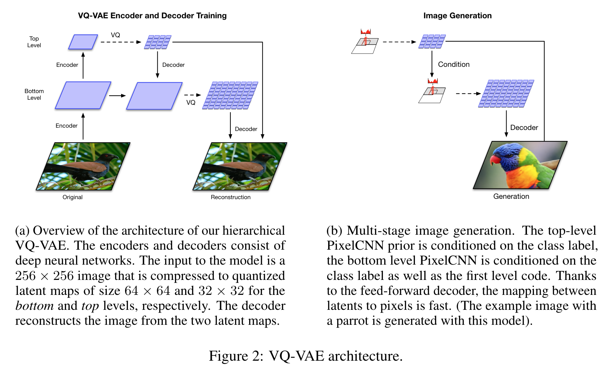
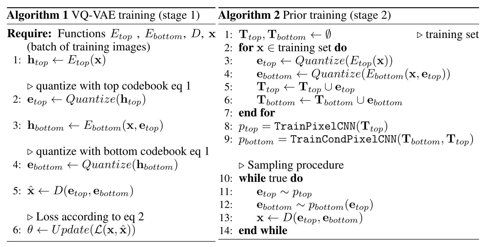
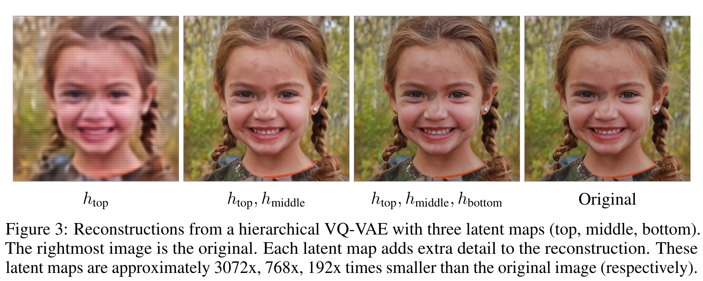

**(논문 요약) Generating Diverse High-Fidelity Images with VQ-VAE-2** [(Paper)](https://arxiv.org/pdf/1906.00446)

## 핵심 내용
- VQ-VAE 를 발전시킴
  - embedding 을 학습하지 않고, encoder output 의 moving average 로 정의  
  
  - 고화질 생성을 위해 2단계로 encoder 를 나눔  
  
  - Prior 를 데이터를 이용하여 학습 (PixelCNN 으로 distribution 모델링)  

- 2단계 encoder 의 효과  

