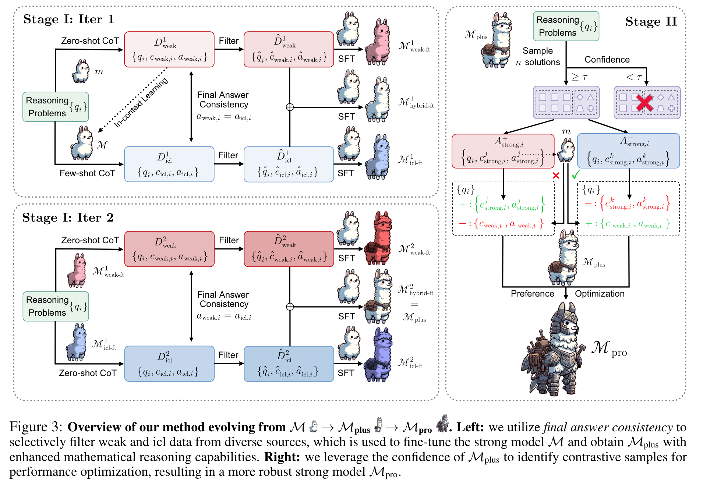
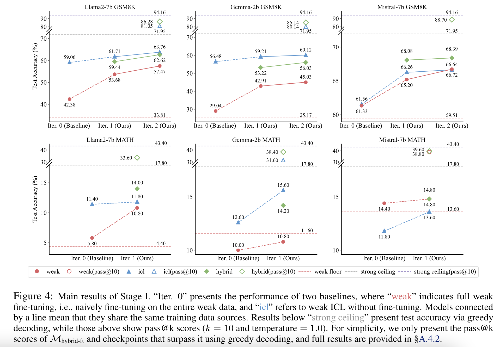
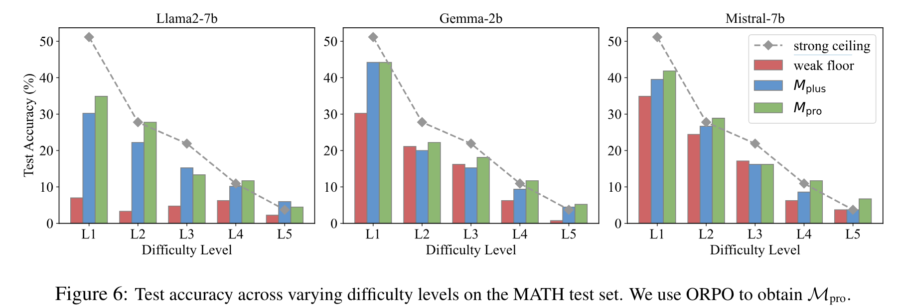

**(논문 요약) Weak-to-Strong Reasoning** [(Paper)](https://arxiv.org/pdf/2407.13647)

## 핵심 내용
- 작은 모델과 큰 모델을 활용하여 데이터 생성
  - stage 1 에서 2개 모델에서 나온 정답이 같으면 정답이라고 가정, hybrid 가 가장 성능이 좋았음 (실험 결과 참조) 
  - stage 2 에서 majority 가 정답이라고 가정하고, 작은 모델의 결과값이 이와 같은지 비교하여 preference data 로 활용   

## 실험 결과

- GT 로 SFT 학습한 모델보다 L4, L5 에서 더 나은 성능을 보임 (GT 의 데이터가 부족한 영역)  

