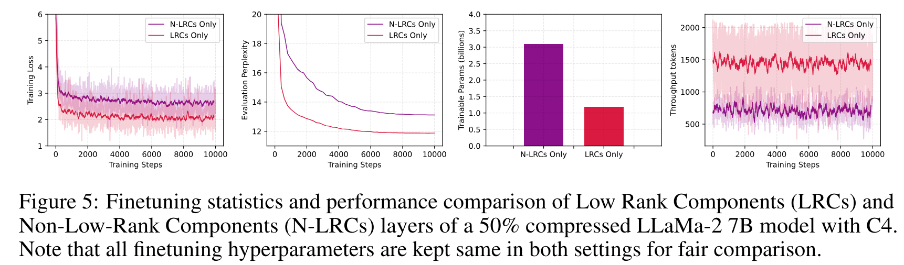
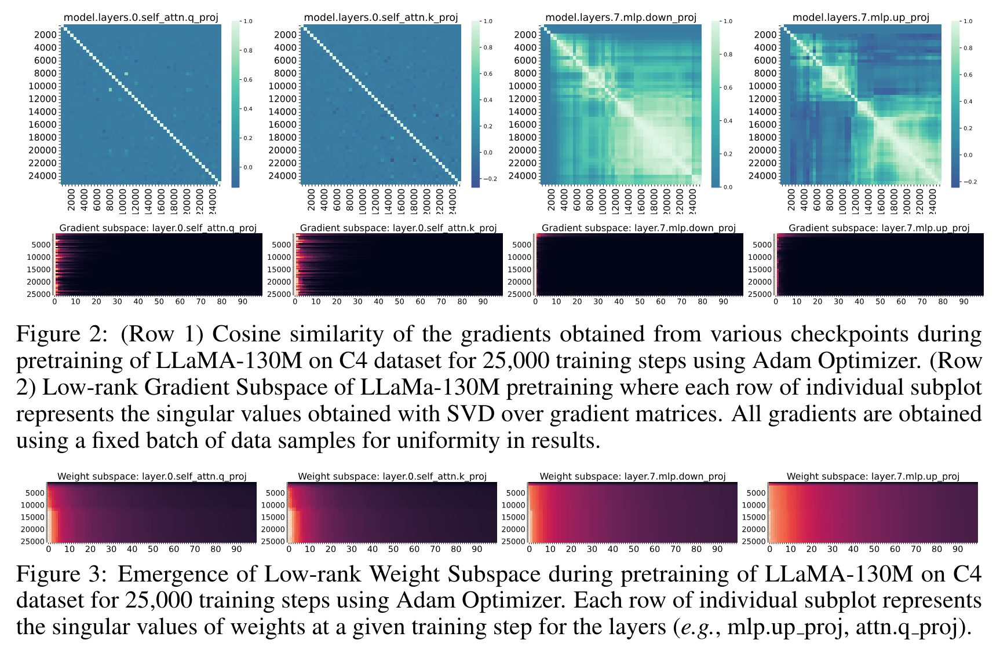
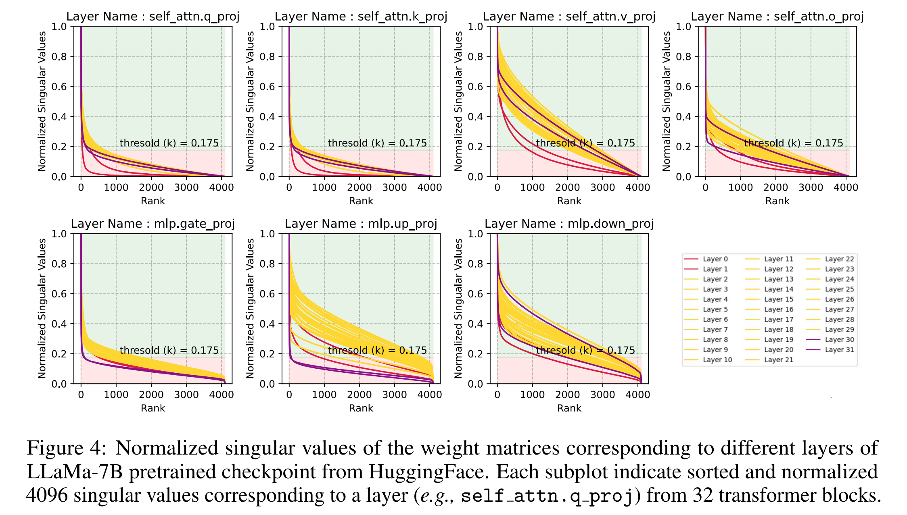
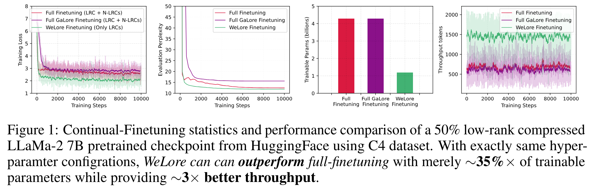
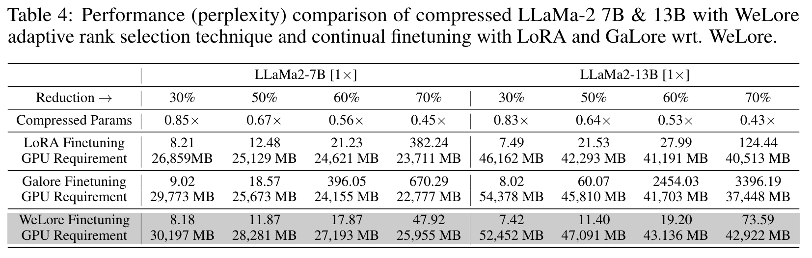
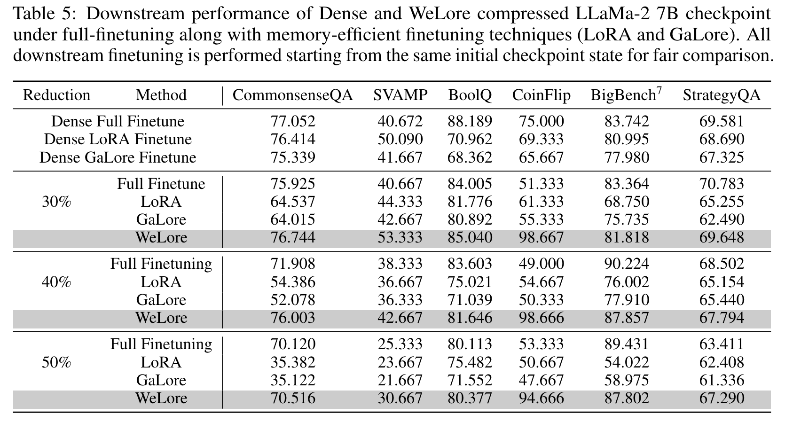
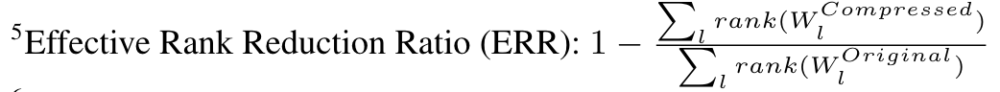
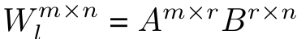

**(논문 요약) From GaLore to WeLore: How Low-Rank Weights Non-uniformly Emerge from Low-Rank Gradients** [(Paper)](https://arxiv.org/pdf/2407.11239)

## 핵심 내용
- Weight 를 Low-rank Components (LRCs), Non-Low-rank Components (N-LRCs) 로 나눈뒤, LRCs 만 학습  

- 학습 초반에만 low-rank gradient 가 나타나는 경우, 최종 weight 는 non-low-rank 가 됨 (model.layers.7.mlp.down_proj, model.layers.7.mlp.up_proj)  

- 일부 레이어에서는 singular value 를 sort 하면 heavy tail 이 보임 (low rank)  

## 실험 결과
- full-finetuning 도 뛰어넘을수 있음  

- parameter 줄인 뒤에는 WeLore 가 LoRA 보다 downstream task 의 최종 성능이 좋음   

   - Reduction 은 다음과 같이 정의 됨  
   
   - low rank 로 변환은 다음 식을 따름  
   