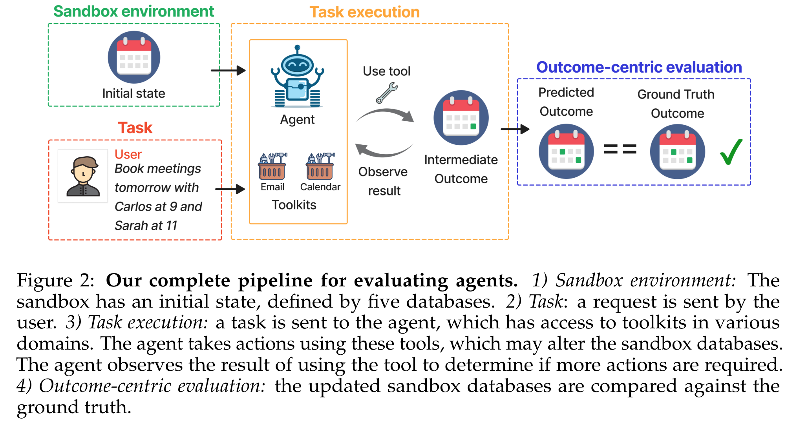
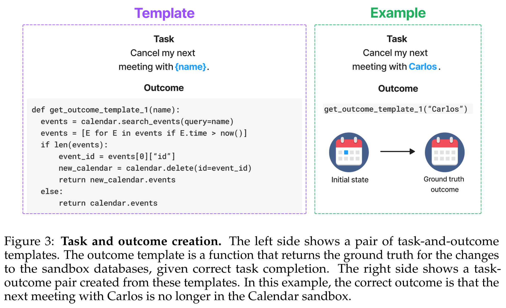
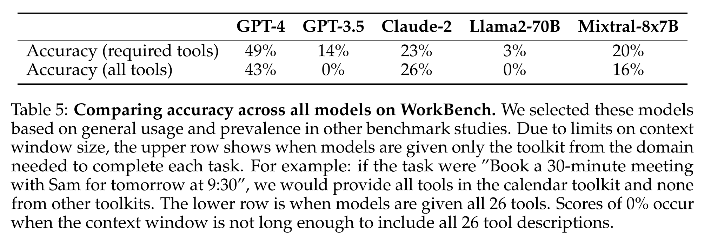

**(논문 요약) WorkBench: a Benchmark Dataset for Agents in a Realistic Workplace Setting** [(Paper)](https://arxiv.org/pdf/2405.00823)

## 핵심 내용
- Calendar, Email, Website, Customer relationship management (CRM), Project management 를 포함
- LLM 의 tool use 를 평가  

- 실행 예시  

- LLM 모델 성능 비교   

